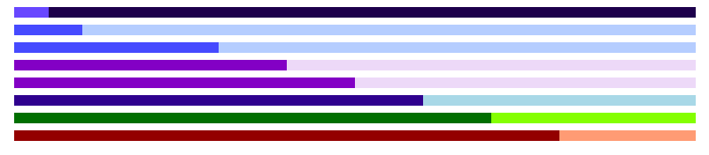

# Square Progress

This project was generated with [Angular CLI](https://github.com/angular/angular-cli) version 17.3.7.

## Development server

Run `ng serve` for a dev server. Navigate to `http://localhost:4200/`. The application will automatically reload if you change any of the source files.

## Code scaffolding

Run `ng generate component component-name` to generate a new component. You can also use `ng generate directive|pipe|service|class|guard|interface|enum|module`.


## Demo 



## How to use 

```html
<ng-progress-square [value]="10" color="#007BFF" colorBackground="#B3D4FF"></ng-progress-square>

<ng-progress-square [value]="30" color="#007BFF" colorBackground="#B3D4FF"></ng-progress-square>
<ng-progress-square [value]="40" color="#6F42C1" colorBackground="#E9DFF7"></ng-progress-square>
<ng-progress-square [value]="50" color="#6F42C1" colorBackground="#E9DFF7"></ng-progress-square>

<ng-progress-square [value]="60" color="#00008B" colorBackground="#ADD8E6"></ng-progress-square>
<ng-progress-square [value]="70" color="#006400" colorBackground="#ADFF2F"></ng-progress-square>

<ng-progress-square [value]="80" color="#8B0000" colorBackground="#FFA07A"></ng-progress-square>

```


## Build

Run `ng build` to build the project. The build artifacts will be stored in the `dist/` directory.

## Running unit tests

Run `ng test` to execute the unit tests via [Karma](https://karma-runner.github.io).

## Running end-to-end tests

Run `ng e2e` to execute the end-to-end tests via a platform of your choice. To use this command, you need to first add a package that implements end-to-end testing capabilities.

## Further help

To get more help on the Angular CLI use `ng help` or go check out the [Angular CLI Overview and Command Reference](https://angular.io/cli) page.
